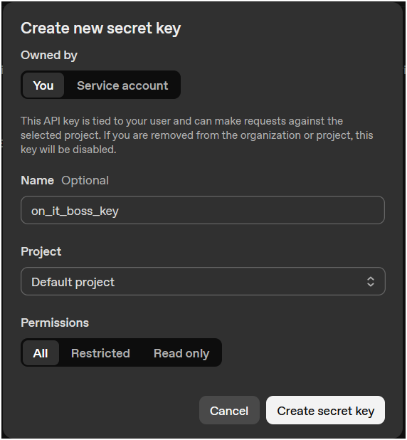

# On It, Boss!

Get ChatGPT to transform Excel data for you!

Type what you want ("Group by Department and sum Salary"), and this add-in asks an LLM for the Power Query (M code), applies it to your table, and saves a replayable history.

## Quick Start

1. **Install**
   
   1. Download this project as a zip file
   
   2. Unzip / Extract
   
   3. Right-click `Install.xlsm`  and choose <u>Properties</u>
   
   
   
   4. Check <u>Unblock</u> and click <u>OK</u>
   
   
   
   5. Do steps 3 & 4 again for `On It, Boss!.xlam`
   
   6. Open Install.xlsm and click the <u>Install</u> button 

2. **Get an OpenAI API key**
   
   1. Go to [https://platform.openai.com/api-keys](https://platform.openai.com/api-keys) 
   2. Log in / sign up
   3. Add some money to your account to make API calls with:
      
      
      
      Click the <u>Settings</u> Icon at the top right
      
      
      
      
      
      Choose <u>Billing</u> on the left panel
      
      
      
      
      
      Add a payment method and add to your credit balance. The minimum of $5.00 is more than enough to get started with.
      
      
   4. Create new secret key:
      
      
      
      Choose <u>API keys</u> on the left panel
      
      
      
      
      
      Click <u>Create new secret key</u> on the right
      
      Fill in any information you'd like:
      
      
      
      
      
      <u>Copy</u> your key. Don't click <u>Done</u> yet until you finish the next step in Excel.
      
      
      
      

3. **Set your key**
   
   - In Excel, on the <u>DATA</u> tab you'll see a new <u>AI Query</u> group right next to the Power Query buttons.
     
     
     
     
   - Click <u>Update API Key</u>, paste your key in the userform, and click <u>Update</u>.  
     This creates a .env file @ `%APPDATA%\Microsoft\AddIns\.env` with a line:  
     `OPENAI_API_KEY=sk-...`
     
     

4. **Use it**
   
   - Put your data in an Excel Table (Ctrl+T)
     
     
     
     
     
     
   - On the <u>DATA</u> tab click the <u>On It, Boss!</u> button to open the panel interface.
     
     
     
     
     
     It will open a new sheet for you where the Power Query transformations can occur. Type something you would like to happen to the data.
     
     
     
     
     
     Choose a model (gpt-5-nano by default), click <u>Ask AI</u> and it will just do it for you.
     
     
     
     
     
     The result is applied as a Power Query to that table, and the request is added to History so you can replay it later.
     
     
     
     
     
     Now you have multiple steps in the listbox above. You can click back and forth between them to view each one:
     
     
     
     
     
     
     
     **Every step is a full ETL process** and contains all the M code necessary to bring the data from its original table up to the current request. So you could even take the code in a few different directions if you wanted and go back and forth between them.
     
     
     
     If you make a step you would like to delete, just select it in the listbox, click the <u>Delete</u> button on your keyboard, and choose which step you would prefer to see.

## Notes

* As with anything related to LLMs, the better you phrase what you'd like to happen, the better it is able to achieve you goal.
* Under the hood, the prompt that is sent to the LLM includes the schema of the origin table, the schema of the current table, the current M code, your request, and guidelines on how to best utilize these pieces. If you'd like to debug the traffic, change `mod_Config.DEBUG_CHAT = True` and results will print to the Immediate Window as they become available.
* Prompt context attempts to keeps changes minimal; starting from your current query's M and appending steps unless otherwise requested.
* If a generated query fails to parse / refresh correctly, it's rolled back automatically.
* A hidden worksheet `_OIBHistory` stores your code History. 
  
  
  
  
  
  

## Requirements

- Excel for Windows with Power Query (modern desktop Excel includes it).
- Internet access and an OpenAI API key.

## Uninstall

- Open Install.xlsm and click the button that says "Uninstall"

## Cost

Requests (including some prompt context, example rows from the data, and your prompt) are sent to OpenAI. API usage is billed by OpenAI under your account. Napkin math I came up with for gpt-5-nano on a small table (fewer columns is better than fewer rows) was ~400 requests for $1.

## License

MIT

